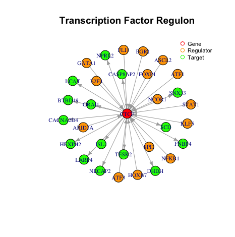
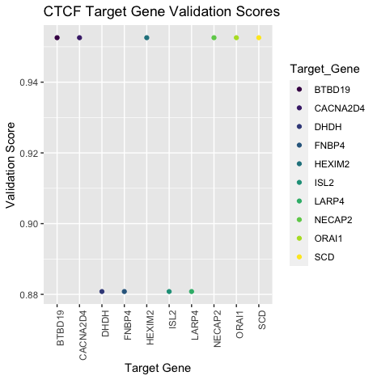
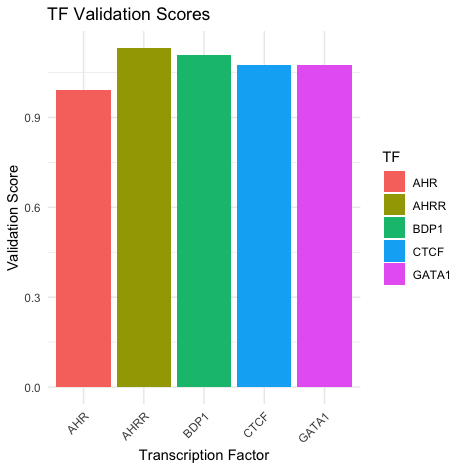
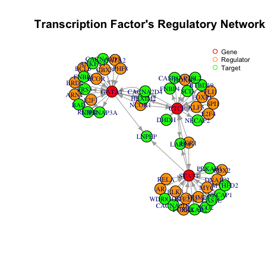
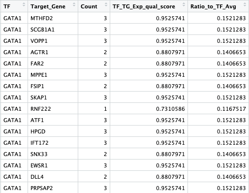
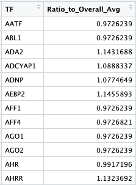

<!-- README.md is generated from README.Rmd. Please edit that file -->

```{r, include = FALSE}
knitr::opts_chunk$set(
  collapse = TRUE,
  comment = "#>",
  fig.path = "./inst/extdata/",
  out.width = "100%"
)
```

# TRNValStandVis
An R package for validation, standardization and visualization of transcription factor - target gene interactions. 

<!-- badges: start -->
<!-- badges: end -->

## Description

`TRNValStandVis` is an R package that visualizes, validates and
standardizes Transcription Factor(TF) - Target Genes(TG) interactions and
Transcription Regulatory Networks(TRN), in regards to representation, and
nomenclatures as well.

It combines transcription factor - target gene interaction data from four data sets, 
the Molecular Signatures Database (MSigDB) by GSEA, hTFtarget by Zhang et al.,
the ChIP-X Enrichment Analysis Version 3 (ChEA3) by Ma'ayan lab, and TFLink by Liska et al. to 
create a single combined dataset, where all TF's and TG's are standardized to be HUGO Gene Nomenclature Committee (HGNC) compliant. 
The combined data was used to create a qualitative score to evaluate the quality of Transcription Factor - Target Gene (TF-TG) interactions
as well a score to assess the overall quality of a specific TF. Further abilities include
visualizing TF-TG regulons and networks and comparing different TF's qualitatively. 
This package will allow for the validation of TF-TG's across different sources, 
quality metrics in regards to level of validation for each TF-TG, as well as 
standardization in regards to nomenclature. The `TRNValStandVis` package was developed using
`R version 4.1.1 (2021-08-10)`, `Platform: x86_64-apple-darwin17.0 (64-bit)` and `Running under: macOS Big Sur 11.6`


## Installation

In order to install the latest version of this package:

```{r, eval=FALSE}
install.packages("devtools")
library("devtools")
devtools::install_github("Mogtaba-Alim/TRNValStandVis", build_vignettes = TRUE)
library("TRNValStandVis")
```

## Overview

```{r, eval=FALSE}
ls("package:TRNValStandVis")
data(package = "TRNValStandVis")
browseVignettes("TRNValStandVis")
```

`TRNValStandVis` consists of 8 functions. 

1. ***get_TGs***
- Take in a TF and return all its target genes. Can be adjusted based on number of datasets TF-TG appears in.

2. ***get_TFs***
- Take in a gene and return all the transcription factors that regulate it. Can be adjusted based on number of datasets TF-TG appears in. 

3. ***plot_TF_regulon***
- Take in a gene and plot that gene's regulon including regulators and targets. 

4. ***plot_TFs_network***
- Take in up to 3 gene names and plot the network involving all the genes regulons combined. 

5. ***get_TF_TG_val***
- Take in a TF and return the validity score for all the TG's of that TF

6. ***plot_TF_TG_val***
- Take in a TF and plot the validity score for all the TG's of that TF

7. ***get_TF_total_val***
- Takes in a TF and provides the average validty score for that TF

8. ***plot_TF_total_val***
- Take in a collection of TF names and plots their average validity score

Below is an example overview of the visualization features available with this package:

`plot_TF_regulon`



*This function plots a graph showing all the TF's that regulate a given gene and all the TG's regulated by it.*


`plot_TF_TG_val`



*This function plots the target genes against their TE_TG_Exp_qual_score for a specified Transcription Factor (TF).*


`plot_TF_total_val`



*This function takes a vector of Transcription Factor (TF) names and plots a graph of their names against their Validation Scores.*


`plot_TFs_network`



*This function plots a combined graph showing all the transcription factors (TFs) that regulate the input genes and all the target genes regulated by them.*


The package will also have 2 datasets. The first dataset called TF_TG_Valid_Comb
will be the combined dataset of TF-TG's and will contain columns for the number
of times an interaction has appeared in the different datasets, the validation
score for each TF-TG and a normalized validation score. The validation score is
represented by TF_TG_Exp_qual_score in the TF_TG_Valid_Comb dataset and is a
qualitative score for each TF-TG interaction based on validation across
datasets and in comparison to other TF-TG's in the combined datasets.
Ratio_to_TF_Avg is the normalized score. 

Below we see an example of the datset.




The second dataset, will be of all the TF's and their overall average validation score. 
This is represented by the Ratio_to_Overall_Avg which is qualitative value
that represents the normalized average validation quality of a specific TF over
all TF-TG interactions in the combined dataset that involved that TF.

Below we see an example of the dataset. 




## Contributions

The author of this package is Mogtaba Alim. All functions and processes including
the processing and the creation of validity scores were done by the author.

The author wrote the get_TF_TG_val function which presents the validation score
for all target genes of a specified transcription factor. The function uses the
filter and arrange functions from the dplyr package to sort the data frame
based on the values of the TF_TG_Exp_qual_score column and to filter the data 
frame for values that match the conditions we are looking for. We also used
the pipe method from the magrittr package for the chaining of functions. 

The author also wrote the get_TF_Total_Val function which presents the 
Ratio_to_Overall_Avg score for a specified transcription factor from the
TF_Avg_Valid dataset. This function used no external packages.  

They author also wrote the get_TFs function which presents a vector of
transcription factors that regulate a specified target gene. This function used
no external packages. 

The author wrote the get_TGs function which presented a vector of target genes
associated with a specified transcription factor name. This function used no 
external packages. 

The author wrote the plot_TF_regulon function which plots a graph showing all
the transcription factors that regulate a given gene and all the
target genes regulated by it. The package utilized three functions from the 
igraph package. Firstly the graph_from_data_frame was used to create a graph
object from a data frame, then the V(graph) function was used to access the nodes
of the graph object created using the igraph package. Finally the layout_with_fr
function was used to create a well spaced layout for the graph, specifically
using the Fruchterman-Reingold layout algorithm, which is a force-directed
algorithm often used for arranging nodes in a visually pleasing manner.

The author wrote the plot_TF_TG_val function which the target genes against
their TF_TG_Exp_qual_score for a specified transcription factor. This function
used several functions from the ggplot2 package. Firstly the ggplot function
was used to create the plot, with that the aes function is used to define 
each part of the data represented on the plot in terms of colors, shapes, sizes etc.
Furthermore, the geom_point was used to add the points to the plot and the 
scale_color_viridis_d was used to set the color scale of the plot. The element_text 
function was used to customize the appearance of text in the plot. Finally the 
labs function was used to add labels to the plot and the theme was used to 
customize these labels. 

The author wrote the plot_TF_Total_Val function which takes a vector of 
transcription factor names and plots a graph of their names against their
validation scores represented by the Ratio_to_Overall_Avg column. The function 
utilized several functions from the ggplot2 package. Firstly the ggplot function
was used to create the plot, with that the aes function is used to define 
each part of the data represented on the plot in terms of colors, shapes, sizes etc.
Furthermore, the geom_point was used to add the points to the plot and the
theme_minimal function was used to apply a minimalist theme to the plot. 
The element_text function was used to customize the appearance of text in the plot.
Finally the  labs function was used to add labels to the plot and the theme was
used to  customize these labels.  

The author also wrote the plot_TFs_network function which plots a combined
graph showing all the transcription factors that regulate the input genes and
all the target genes regulated by them. The function uses two functions from 
the igraph package. Firstly the graph_from_data_frame was used to create a graph
object from a data frame, then the V(graph) function was used to access the nodes
of the graph object created using the igraph package.

Other packages used outside functions include the testthat package which was
used to test the functions of the package. Furthermore, the knittr package was
used to parse the vingettes file along with the rmarkdown package. 

No other aids were used in the generation of this package. 

## References

- Allaire J, Xie Y, Dervieux C, McPherson J, Luraschi J, Ushey K, Atkins A, Wickham H, Cheng J, Chang W, Iannone R (2023). _rmarkdown: Dynamic Documents for R_. R package version 2.25, <https://github.com/rstudio/rmarkdown>.

- Bache S, Wickham H (2022). _magrittr: A Forward-Pipe Operator for R_. R package version 2.0.3, <https://CRAN.R-project.org/package=magrittr>.

- Chang W, Cheng J, Allaire J, Sievert C, Schloerke B, Xie Y, Allen J, McPherson J, Dipert A, Borges B (2023). _shiny: Web Application Framework for R_. R package version 1.8.0.9000, https://github.com/rstudio/shiny, <https://shiny.posit.co/>.

- Csardi G, Nepusz T (2006). “The igraph software package for complex network research.” _InterJournal_, *Complex Systems*, 1695. <https://igraph.org>.

- Fujiyoshi, K., Bruford, E. A., Mroz, P., Sims, C. L., O’Leary, T. J., Lo, A. W. I., … Ogino, S. (2021). Standardizing gene product nomenclature—a call to action. *Proceedings of the National Academy of Sciences of the United States of America*, 118(3). doi:10.1073/pnas.2025207118

- H. Wickham. ggplot2: Elegant Graphics for Data Analysis. *Springer-Verlag New York*, 2016. https://ggplot2.tidyverse.org

- Lachmann, A., Xu, H., Krishnan, J., Berger, S. I., Mazloom, A. R., & Ma’ayan, A. (2010). ChEA: transcription factor regulation inferred from integrating genome-wide ChIP-X experiments. *Bioinformatics (Oxford, England)*, 26(19), 2438–2444. doi:10.1093/bioinformatics/btq466

- Liberzon, A., Birger, C., Thorvaldsdóttir, H., Ghandi, M., Mesirov, J. P., & Tamayo, P. (2015). The molecular signatures database hallmark gene set collection. *Cell Systems*, 1(6), 417–425. doi:10.1016/j.cels.2015.12.004

- Liska, O., Bohár, B., Hidas, A., Korcsmáros, T., Papp, B., Fazekas, D., & Ari, E. (2022). TFLink: an integrated gateway to access transcription factor–target gene interactions for multiple species. *Database: The Journal of Biological Databases and Curation*, 2022, baac083. doi:10.1093/database/baac083

- R Core Team (2022). R: A language and environment for statistical computing. R Foundation for Statistical Computing, Vienna, Austria. https://www.R-project.org/

-  Wickham H (2011). “testthat: Get Started with Testing.” _The R Journal_, *3*, 5-10. <https://journal.r-project.org/archive/2011-1/RJournal_2011-1_Wickham.pdf>.

- Wickham H, François R, Henry L, Müller K, Vaughan D (2023). _dplyr: A Grammar of Data Manipulation_. R package version 1.1.4, <https://CRAN.R-project.org/package=dplyr>.

- Xie Y (2023). _knitr: A General-Purpose Package for Dynamic Report Generation in R_. R package version 1.45, <https://yihui.org/knitr/>.

- Zhang, Q., Liu, W., Zhang, H.-M., Xie, G.-Y., Miao, Y.-R., Xia, M., & Guo, A.-Y. (2020). HTFtarget: A comprehensive database for regulations of human transcription factors and their targets. *Genomics, Proteomics & Bioinformatics*, 18(2), 120–128. doi:10.1016/j.gpb.2019.09.006

## Acknowledgements

This package was developed as part of an assessment for 2023 BCB410H: Applied Bioinformat-
ics course at the University of Toronto, Toronto, CANADA. `TRNValStandVis` welcomes issues,
enhancement requests, and other contributions. To submit an issue, use the GitHub issues.

## Package Structure
   
```r
.
├── DESCRIPTION
├── LICENSE
├── LICENSE.md
├── Meta
│   └── vignette.rds
├── NAMESPACE
├── R
│   ├── data.R
│   ├── get_TF_TG_val.R
│   ├── get_TF_Total_Val.R
│   ├── get_TFs.R
│   ├── get_TGs.R
│   ├── plot_TF_TG_val.R
│   ├── plot_TF_Total_Val.R
│   ├── plot_TF_regulon.R
│   ├── plot_TFs_network.R
│   └── runTRNValStandVis.R
├── README.Rmd
├── README.md
├── TRNValStandVis.Rproj
├── data
│   ├── TF_Avg_Valid.rda
│   ├── TF_TG_Valid_Comb.rda
├── doc
│   ├── TRNValStandVisVignettes.R
│   ├── TRNValStandVisVignettes.Rmd
│   └── TRNValStandVisVignettes.html
├── inst
│   ├── CITATION
│   ├── extdata
│   │   ├── TF_Avg_Valid_Example.png
│   │   ├── TF_TG_Valid_Comb_Example.png
│   │   ├── get_TF_TG_val_Example_1.png
│   │   ├── get_TF_TG_val_Example_2.png
│   │   ├── get_TF_TG_val_Example_3.png
│   │   ├── get_TFs_Example_1.png
│   │   ├── get_TFs_Example_2.png
│   │   ├── get_TFs_Example_3.png
│   │   ├── get_TGs_Example_1.png
│   │   ├── get_TGs_Example_2.png
│   │   ├── get_TGs_Example_3.png
│   │   ├── plot_TF_TG_val_Example.png
│   │   ├── plot_TF_TG_val_Example_1.png
│   │   ├── plot_TF_TG_val_Example_2.png
│   │   ├── plot_TF_TG_val_Example_3.png
│   │   ├── plot_TF_regulon_Example.png
│   │   ├── plot_TF_regulon_Example_1.png
│   │   ├── plot_TF_regulon_Example_2.png
│   │   ├── plot_TF_regulon_Example_3.png
│   │   ├── plot_TF_total_val_Example.png
│   │   ├── plot_TF_total_val_Example_1.png
│   │   ├── plot_TFs_network_Example.png
│   │   ├── plot_TFs_network_Example_1.png
│   │   ├── plot_TFs_network_Example_2.png
│   │   └── plot_TFs_network_Example_3.png
│   └── shiny-scripts
│       ├── app.R
│       └── www
│           ├── TF_Avg_Valid_Example.png
│           ├── TF_TG_Valid_Comb_Example.png
│           ├── get_TF_TG_val_Example_1.png
│           ├── plot_TF_TG_val_Example.png
│           ├── plot_TF_regulon_Example.png
│           ├── plot_TF_total_val_Example.png
│           └── plot_TFs_network_Example.png
├── man
│   ├── TF_Avg_Valid.Rd
│   ├── TF_TG_Valid_Comb.Rd
│   ├── get_TF_TG_val.Rd
│   ├── get_TF_Total_Val.Rd
│   ├── get_TFs.Rd
│   ├── get_TGs.Rd
│   ├── plot_TF_TG_val.Rd
│   ├── plot_TF_regulon.Rd
│   ├── plot_TF_total_val.Rd
│   ├── plot_TFs_network.Rd
│   └── runTRNValStandVis.Rd
├── tests
│   ├── testthat
│   │   ├── _snaps
│   │   ├── test-get_TF_TG_val.R
│   │   ├── test-get_TF_Total_Val.R
│   │   ├── test-get_TFs.R
│   │   ├── test-get_TGs.R
│   │   ├── test-plot_TF_TG_val.R
│   │   ├── test-plot_TF_Total_Val.R
│   │   ├── test-plot_TF_regulon.R
│   │   └── test-plot_TFs_network.R
│   └── testthat.R
└── vignettes
    └── TRNValStandVisVignettes.Rmd
```

