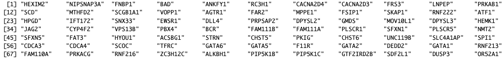

# TRNValStandVis

## Introduction

`TRNValStandVis` is an R package that visualizes, validates and
standardizes Transcription Factor(TF) - Target Genes(TG) interactions and
Transcription Regulatory Networks(TRN), in regards to representation, and
nomenclatures as well.

It combines transcription factor - target gene interaction data from four data sets, 
the Molecular Signatures Database (MSigDB) by GSEA, hTFtarget by Zhang et al.,
the ChIP-X Enrichment Analysis Version 3 (ChEA3) by Ma'ayan lab, and TFLink by Liska et al. to 
create a single combined dataset, where all TF's and TG's are standardized to be HUGO Gene Nomenclature Committee (HGNC) compliant. 
The combined data was used to create a qualitative score to evaluate the quality of Transcription Factor - Target Gene (TF-TG) interactions
as well a score to assess the overall quality of a specific TF. Further abilities include
visualizing TF-TG regulons and networks and comparing different TF's qualitatively. 
This package will allow for the validation of TF-TG's across different sources, 
quality metrics in regards to level of validation for each TF-TG, as well as 
standardization in regards to nomenclature.

Use the following commands to download **TRNValStandVis**

```r
install.packages("devtools")
library("devtools")
devtools::install_github("Mogtaba-Alim/TRNValStandVis", build_vignettes = TRUE)
library("TRNValStandVis")
```

To list all sample functions available in the package:

```r
 ls("package:TRNValStandVis")
```
 
To list all the sample datasets in the package:
 
```r
data(package= "TRNValStandVis")
```
 
## Minimal Requirements
 
 The minimal requirements for this package include, the R. directory, data which has
 the packages data, man containing the documentation, Description and Namespace. 
 
## Applications 

In this section we will demonstrate the applications of the package by showcasing
the different functions, example use cases and sample outputs. We will also
showcase the datasets available with the package and the data available in them. 


### Datasets

The **MissensePathoR** package includes two custom datasets. TF_TF_Valid_Comb
and TF_Avg_Valid. We will go into more detail below on both the datasts, their
data and how to use them.

#### TF_TG_Valid_Comb 

This dataset combines data from the ChEA3, hTFtarget, MSigDB and TFLink datasets to
create a dataset of all the TF-TG interactions available in all the 4 datasets.
As part of the data standardization process, all genes that did not have a
translatable HGNC symbol, even in alternate nomenclatures was removed. Based on
the count of appearance of a TF-TG in the datasets a validation score was created.
TF_TG_Exp_qual_score is a qualitative score for each TF-TG interaction based
on validation across datasets and in comparison to other TF-TG's in the
combined datasets. Ratio_to_TF_Avg is a normalized validation score based on 
each TF_TG_Exp_qual_score relative to that for all the the scores for that TF. 

Viewing and using the TF_TG_Valid_Comb dataset:

```{r}
head(TRNValStandVis::TF_TG_Valid_Comb)
?TRNValStandVis::TF_TG_Valid_Comb
```

#### TF_Avg_Valid

This dataset maps every HGNC standardized TF to its overall avg validation score
over all it TF-TG interactions. Ratio_to_Overall_Avg is a qualitative value
that represents the normalized average validation quality of a specific TF
over all TF-TG interactions in the combined dataset that involved that TF.

Viewing and using the TF_Avg_Valid dataset:

```{r}
head(TRNValStandVis::TF_Avg_Valid)
?TRNValStandVis::TF_Avg_Valid
```


### Getting the Target Genes (TGs) of a Transcription Factor (TF)
 
1. get_TGs

#### Usage

- Take in a TF and return all its target genes. 
- Output can be adjusted based on number of datasets TF-TG appears in using validation_freq parameter.
- Can also  adjust the size of the output vector using the max_size parameter. 
- Utilizes data from the TF_TG_Valid_Comb dataset.

#### Example

Here we show a few examples showcase the how the get_TGs functions is utlized. 
We will also show what the sample output will look like. 

```r
# To check the documentation of the get_TGs function
?TRNValStandVis::get_TGs
```

```r
# Get all the target genes of the GATA1 TF. 
TRNValStandVis::get_TGs("GATA1")
```



```r
# Get all the target genes of the GATA1 TF, validated in 3 datasets. 
TRNValStandVis::get_TGs("GATA1", validation_freq = 3)
```


```r
# Get at max 40 target genes of the GATA1 TF, validated in 2 datasets.. 
TRNValStandVis::get_TGs("GATA1")
```


### Getting the Target Factors (TFs) that target a gene

2. get_TFs

#### Usage

- Take in a gene and return all the transcription factors that regulate it.
- Output can be adjusted based on number of datasets TF-TG appears in using validation_freq parameter.
- Can also  adjust the size of the output vector using the max_size parameter. 
- Utilizes data from the TF_TG_Valid_Comb dataset.

#### Examples

Here we show a few examples showcase the how the get_TFs functions is utilized. 
We will also show what the sample output will look like. 

```r

# To check the documentation of the get_TFs function
?TRNValStandVis::get_TFs
```

```r
# Get all the TF's that target the CTCF gene
TRNValStandVis::get_TFs("CTCF")
```


```r
# Get all the TF's that target the CTCF gene, validated in 3 datasets.
TRNValStandVis::get_TFs("CTCF", validation_freq = 3)
```


```r
# Get at max 15 of the TF's that target the CTCF gene, validated in 2 datasets
TRNValStandVis::get_TFs("CTCF", validation_freq = 2, max_size = 15)
```


### Plot the regulon centered on the transcription factor

3. plot_TF_regulon

### Usage

- Take in a gene and plot that gene’s regulon including regulators and targets.
- Allows the user to modify the max number of TF's that target the input gene to plot
- Allows the user to modify the max number of TG's that are targeted by the input gene to plot
- Utilizes data from the TF_TG_Valid_Comb dataset.

#### Examples

Here we show a few examples showcase the how the plot_TF_regulon function is utilized. 
We will also show what the sample output will look like. 

```r
# To view the documentation of the plot_TF_regulon function
?TRNValStandVis::plot_TF_regulon
```


```r
# Plot the regulon of the STAT1 gene. Defaults to 30 TFs and 30 TGs
TRNValStandVis::plot_TF_regulon("STAT1")
```


```r
# Plot the regulon of the STAT1 gene, limit the TFs to 15. 
TRNValStandVis::plot_TF_regulon("STAT1", max_TFs = 15)
```


```r
# Plot the regulon of the STAT1 gene, limit the TFs to 15 and the TGs to 5. 
TRNValStandVis::plot_TF_regulon("STAT1", max_TFs = 15, max_targets = 5)
```


### Plot the network of regulon for a collection of TFs

4. plot_TFs_network

#### Usage

- Take in up to 3 gene names and plot the network involving all the genes regulons combined.
- Allows the user to modify the max number of TF's that target each input gene to plot
- Allows the user to modify the max number of TG's that are targeted by each input gene to plot
- Utilizes data from the TF_TG_Valid_Comb dataset.

#### Examples

Here we show a few examples showcase the how the plot_TFs_network function is utilized. 
We will also show what the sample output will look like. 

```r
# To view the documentation of the plot_TFs_network function
?TRNValStandVis::plot_TFs_network
```


```r
# Plot the network of the STAT1, CTCF and GATA1 genes. Defaults to 10 TFs and 10 TGs
TRNValStandVis::plot_TFs_network(c("STAT1", "CTCF", "GATA1"))

```


```r
# Plot the network of the STAT1, CTCF and GATA1 genes. 
# Increase the TFs of all genes to 15
TRNValStandVis::plot_TFs_network(c("STAT1", "CTCF", "GATA1"), max_TFs = 15)

```


```{r
# Plt the network of the STAT1, CTCF and GATA1 genes. 
# Increase the TFs of all genes to 15. 
# Increase the TGs of all genes to 15. 
TRNValStandVis::plot_TFs_network(c("STAT1", "CTCF", "GATA1"), max_TFs = 15, max_targets = 15)
```


### Obtain the TF-TG validation score for a TF

5. get_TF_TG_val

#### Usage

- Take in a TF and return the validity score for all the TG’s of that TF
- Output can be adjusted based on number of datasets TF-TG appears in using validation_freq parameter.
- Allows the user to modify the max number of TG's that are returned.
- Utilizes data from the TF_TG_Valid_Comb dataset.

#### Examples

Here we show a few examples showcase the how the get_TF_TG_val function is utilized. 
We will also show what the sample output will look like. 

```{r, eval=FALSE}
# To view the documentation of the get_TF_TG_val function
?TRNValStandVis::get_TF_TG_val
```

```r
# Get all the validation scores of the Tg's targetd by the CTCF gene
TRNValStandVis::get_TF_TG_val("CTCF")
```


```r
# Get all the validation scores of the TG's targetd by the CTCF gene
# Restrict the output to TF-TGs interactions validated across 2 datasets
TRNValStandVis::get_TF_TG_val("CTCF", validation_freq = 2)
```


```r
# Get all the validation scores of the TG's targetd by the CTCF gene
# Restrict the output to TF-TGs interactions validated across 2 datasets
# Restrict the output to 10 TF-TGs
TRNValStandVis::get_TF_TG_val("CTCF", validation_freq = 2, max_size = 10)
```


### Plot the validation scores for the TGs of a TF

6. plot_TF_TG_val

#### Usage

- Take in a TF and plot the validity score for all the TG’s of that TF
- Output can be adjusted based on number of datasets TF-TG appears in using validation_freq parameter.
- Allows the user to modify the max number of TG's that are returned.
- Utilizes data from the TF_TG_Valid_Comb dataset.

### Examples

Here we show a few examples showcase the how the plot_TF_TG_val function is utilized. 
We will also show what the sample output will look like. 

```r
# To view the documentation of the plot_TF_TG_val function
?TRNValStandVis::plot_TF_TG_val
```

```r
# Plot the validation scores of the TG's targetd by the SATA1 gene. Default at 30 TGs
TRNValStandVis::plot_TF_TG_val("SATA1")
```


```r
# Plot the validation scores of the TG's targetd by the GATA1 gene. Default at 30 TGs
TRNValStandVis::plot_TF_TG_val("GATA1")
```


```r
# Plot the validation scores of the TG's targetd by the GATA1 gene. Default at 30 TGs
# Restrict the plot to TF-TGs interactions validated across 2 datasets
TRNValStandVis::plot_TF_TG_val("GATA1", validation_freq = 2)
```


```r
# Plot the validation scores of the TG's targetd by the GATA1 gene. Default at 30 TGs
# Restrict the plot to TF-TGs interactions validated across 2 datasets
# Restrict the output to 15 TGs
TRNValStandVis::plot_TF_TG_val("GATA1", validation_freq = 2, max_size = 15)
```


### Get the normalized avaerage validation score of a TF 

7. get_TF_Total_Val

#### Usage

- Takes in a TF and provides the average validity score for that TF
- Utilizes data from the TF_Avg_Valid dataset.

#### Example

Here we show a few examples showcase the how the get_TF_Total_Val function is utilized. 
We will also show what the sample output will look like.

```r
# To view the documentation of the get_TF_total_val function
?TRNValStandVis::get_TF_Total_Val
```

```r
# Get the normalized validation score of the by the STAT1 gene.
TRNValStandVis::get_TF_Total_Val("STAT1")
```

*1.033731*


### Get the normalized avaerage validation score of a collection of TFs 

8. plot_TF_total_val

#### Usage

- Take in a collection of TF names and plots their normalized average validity score.
- Utilizes data from the TF_Avg_Valid dataset.

#### Example

Here we show a few examples showcase the how the get_TF_Total_Val function is utilized. 
We will also show what the sample output will look like.

```{r, eval= FALSE}
# To view the documentation of the plot_TF_Total_Val function
?TRNValStandVis::plot_TF_total_val
```


```r
# Plot the normalized validity score of the input TFs
TRNValStandVis::plot_TF_total_val(c("CTCF", "GATA1", "STAT1", "AHRR", "BDP1", "EGR1"))
```


## Package Refernces

- Alim, M. (2023) TRNValStandVis: An R package for validation, standardization and visualization of transcription factor - target gene
  interactions. Unpublished. URL https://github.com/Mogtaba-Alim/TRNValStandVis 

## Package References

- Allaire J, Xie Y, Dervieux C, McPherson J, Luraschi J, Ushey K, Atkins A, Wickham H, Cheng J, Chang W, Iannone R (2023). _rmarkdown: Dynamic Documents for R_. R package version 2.25, <https://github.com/rstudio/rmarkdown>.

- Bache S, Wickham H (2022). _magrittr: A Forward-Pipe Operator for R_. R package version 2.0.3, <https://CRAN.R-project.org/package=magrittr>.

- Csardi G, Nepusz T (2006). “The igraph software package for complex network research.” _InterJournal_, *Complex Systems*, 1695. <https://igraph.org>.

- Fujiyoshi, K., Bruford, E. A., Mroz, P., Sims, C. L., O’Leary, T. J., Lo, A. W. I., … Ogino, S. (2021). Standardizing gene product nomenclature—a call to action. Proceedings of the National Academy of Sciences of the United States of America, 118(3). doi:10.1073/pnas.2025207118

- H. Wickham. ggplot2: Elegant Graphics for Data Analysis. Springer-Verlag New York, 2016. https://ggplot2.tidyverse.org

- Lachmann, A., Xu, H., Krishnan, J., Berger, S. I., Mazloom, A. R., & Ma’ayan, A. (2010). ChEA: transcription factor regulation inferred from integrating genome-wide ChIP-X experiments. Bioinformatics (Oxford, England), 26(19), 2438–2444. doi:10.1093/bioinformatics/btq466

- Liberzon, A., Birger, C., Thorvaldsdóttir, H., Ghandi, M., Mesirov, J. P., & Tamayo, P. (2015). The molecular signatures database hallmark gene set collection. Cell Systems, 1(6), 417–425. doi:10.1016/j.cels.2015.12.004

- Liska, O., Bohár, B., Hidas, A., Korcsmáros, T., Papp, B., Fazekas, D., & Ari, E. (2022). TFLink: an integrated gateway to access transcription factor–target gene interactions for multiple species. Database: The Journal of Biological Databases and Curation, 2022, baac083. doi:10.1093/database/baac083

- R Core Team (2022). R: A language and environment for statistical computing. R Foundation for Statistical Computing, Vienna, Austria. https://www.R-project.org/

-  Wickham H (2011). “testthat: Get Started with Testing.” _The R Journal_, *3*, 5-10. <https://journal.r-project.org/archive/2011-1/RJournal_2011-1_Wickham.pdf>.

- Wickham H, François R, Henry L, Müller K, Vaughan D (2023). _dplyr: A Grammar of Data Manipulation_. R package version 1.1.4, <https://CRAN.R-project.org/package=dplyr>.

- Xie Y (2023). _knitr: A General-Purpose Package for Dynamic Report Generation in R_. R package version 1.45, <https://yihui.org/knitr/>.

- Zhang, Q., Liu, W., Zhang, H.-M., Xie, G.-Y., Miao, Y.-R., Xia, M., & Guo, A.-Y. (2020). HTFtarget: A comprehensive database for regulations of human transcription factors and their targets. Genomics, Proteomics & Bioinformatics, 18(2), 120–128. doi:10.1016/j.gpb.2019.09.006

----

```{r}
sessionInfo()
```
